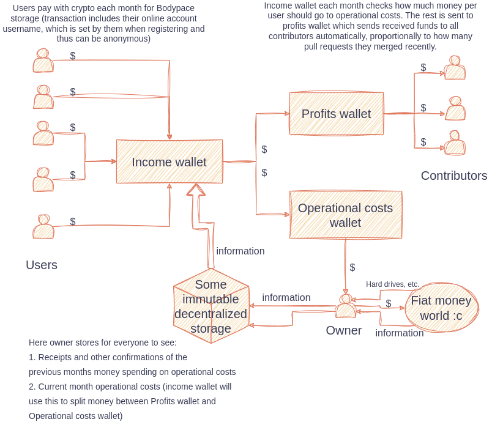

# Bodypace

> Below is not fully implemented yet, development is in progress

### Organization structure

Our apps are open source and free, but our storage is not. It was decided that revenue from storage will be automatically shared among Bodypace contributors via crypto.

&nbsp;

&nbsp;

> Owner will be gradually replaced (maybe not fully) with DAO voting over time.

> We use blockchains for their smart contracts, not their "crypto" (coins/tokens). Bodypace offers no custom tokens and all payments are in U.S. dollar stablecoin (e.g. USDT)

&nbsp;

### Why crypto

- because finances are very transparent and trustworthy this way

- because users can be anonymous (if they pay with crypto, we want to implement other payment methods as well in the future)

- because contributors can be anonymous (if GitHub account does not leak their real identity)

- because everything is automated, inclusive and decentralized: we need no accounting team, no office, no recruitment process, etc.

### Contributing

Everyone can become a paid contributor, there are no requirements besides writing good code. We only care about the PR correctness.

We only require contributors to communicate with us in comment sections of theirs Tickets/Issues and Pull Requests.

Everybody, not only contributors, is more than welcomed to interact with others on our Discord server to participate in meetings (e.g. scrum planning), random chats, mentoring or being mentored, or generally connecting with like minded people.

Also, if some mechanism that is explained in this document is not implemented/automated yet, it's probably being discussed and done manually using Discord chat and/or GH discussions/issue for now (until proper automation is implemented). 

### Tickets

Before starting to work on a PR, a contributor should request to get assigned to a corresponding ticket (GitHub Issue). This way no work is duplicated. Request approval will be automated in the future.

Also we implement a system of priority, where a contributor that did more tasks or was more focused on a given part of the codebase has a priority in picking up relevant tickets. Therefore, by solving tickets regularly a contributor becomes secure that he will have other tickets to work on in next sprint, which makes him kinda "self-hired".

This system of priority will be completely automated but before that contributors need to raise their interest in a particular ticket in that ticket comments section. 

### DAO status

Bodypace is not a DAO, at least not for now (probably will be in the future). Revenue is being split automatically, but e.g. tickets, sprints and reviews are not being voted on blockchain right now. We are however very transparent and open-source already so there is a guarantee that if the change gets approved and merged it will be rewarded, and everyone can suggest changes or copy Bodypace apps to reorganize governance model and check if another approach is better.

Note that we are truly decentralized and open (inclusive). There are e.g. U.S.A. companies that are "DAO" because they use voting. We are not autonomous (yet), but everyone can request a ticket, get the opportunity to do a PR in a fair process (ideally automated), submit a PR, and receive their share of profits... repeatedly and reliably! You do not have to have U.S. citizenship, a degree, failureless history of employment, ability to sell yourself, smooth talk, decent appearance (lookism is a thing), pass a test (invert a binary tree), and more. You just have to be able to code, or configure AI properly so it passes our review (for those interested - whoever does that will probably reach high ticket claim priority and over time own almost all revenue of the company until competing AI shows up).

### PR Bounties ("payments") delivery and calculation details

To receive a bounty for your merged PR, add a comment to your pull request with the address of your wallet, like this: `deliver bounty to 0x111122223333...`. Author of the comment must be the person that is the author of the PR. Blockchain network was not decided yet, probably a few will be supported. If the comment with wallet address is missing, the funds will be waiting for 10 months for that comment after "payday" and then, if still unclaimed, will be distributed as profit among other contributors.

Each first day of a month, smart contract will calculate how many tickets were done during previous month, sum their story points, and calculate how many story points belong to each contributor wallet address. Then, proportionally to the total sum of story points, each wallet will get 10 times their share of 10% of what is currently in profits wallet over the timespan of 10 months. This promotes long term thinking, gives some income stability and allows contributors to profit from the difference they made.

##### Ticket story points

Tickets are evaluated and estimated before being added to some sprint and open to be assigned to any contributor. Evaluation and estimation happens each week on Discord, feel free to join. In future this process may be partially or fully automated.

In the end, each task is either deemed as:

- trivial = 1 story point

- small (easy) = 2 story points

- medium (solid) = 4 story points

- large (hard) = 8 story points 

In future, tickets that are not being picked up will gain more story points over time, to increase interest in them and adjust potentially lower that in should be estimation.

##### Example

In January, the sum of all tickets completed during that month was 80 story points. One contributor did 40 story points. That means he will get 50% of the profit. Instead of getting 50% of what is in the Profits Wallet at Feb 1'st, he will get:

- 5% of what is in Profits Wallet on Feb 1'st
- 5% of what is in Profits Wallet on Mar 1'st
- 5% of what is in Profits Wallet on Apr 1'st
- 5% of what is in Profits Wallet on May 1'st
- 5% of what is in Profits Wallet on Jun 1'st
- 5% of what is in Profits Wallet on Jul 1'st
- 5% of what is in Profits Wallet on Aug 1'st
- 5% of what is in Profits Wallet on Sep 1'st
- 5% of what is in Profits Wallet on Oct 1'st
- 5% of what is in Profits Wallet on Nov 1'st

Assuming that Bodypace revenue did not change over the year, he will in the end get the same amount of money as he would from 50% at Feb 1'st. However, assuming his change made a difference and thus increased profits, his net profit is higher.

##### Example 2

Contributor was active for three months, starting in Jan, and then left. First month (Jan) this contributor completed 50% of all story points completed in Jan. In the second month (Feb) it was 30% of all completed story points in Feb. In third month (Mar) it was 35% of all story points completed in Mar. This is how much his wallet will receive:

- 5% of what is in Profits Wallet on Feb 1'st
- 8% of what is in Profits Wallet on Mar 1'st (5% + 3%)
- 11.5% of what is in Profits Wallet on Apr 1'st  (5% + 3% + 3.5%)
- 11.5% of what is in Profits Wallet on May 1'st
- 11.5% of what is in Profits Wallet on Jun 1'st
- 11.5% of what is in Profits Wallet on Jul 1'st
- 11.5% of what is in Profits Wallet on Aug 1'st
- 11.5% of what is in Profits Wallet on Sep 1'st
- 11.5% of what is in Profits Wallet on Oct 1'st
- 11.5% of what is in Profits Wallet on Nov 1'st
- 6.5% of what is in Profits Wallet on Dec 1'st (3% + 3.5%)
- 3.5% of what is in Profits Wallet on Jan 1'st, next year

## Investors and Tokens

Bodypace does not provide any tokens or a mechanism for investors to participate.
This is because we don't want anyone to lose money and then say Bodypace is a scam.
Even if that claim was not true, because we operate in crypto realm many people would not even want to hear us explaining that we are fair and that investment = risk.
